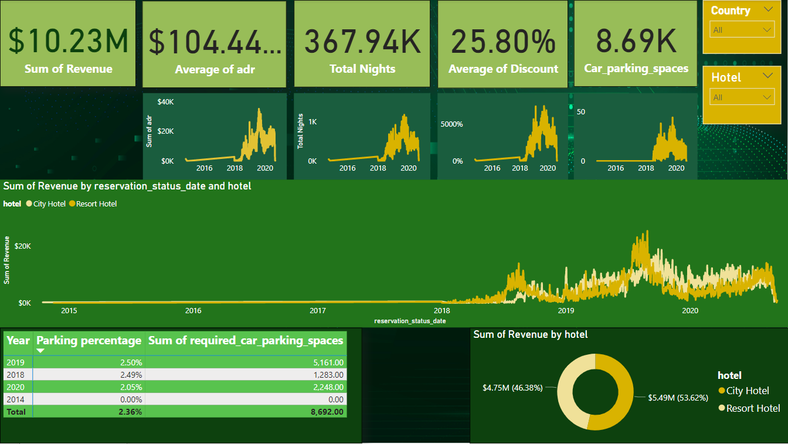

# Hotel Data Analysis (SQL + Power BI)

An analysis of hotel booking data across several years, using SQL to combine and prepare the data and Power BI to report on revenue, occupancy and parking demand.

## Questions answered

- Is hotel revenue growing year over year, and how does it split between the City Hotel and the Resort Hotel?
- Is there enough demand to justify increasing the car parking capacity?
- What trends are visible in nightly rates, total nights and discounts?

## What it shows

| Measure | Value |
|---|---|
| Total revenue | $10.23M |
| Total nights | 367.94K |
| Average discount | 25.80% |
| Required car parking spaces | 8.69K |
| Revenue split | Resort Hotel 53.62%, City Hotel 46.38% |

## How it was built

| Step | Detail |
|---|---|
| Combine the yearly tables | SQL `UNION` of the 2018, 2019 and 2020 booking tables in a common table expression |
| Enrich the data | `LEFT JOIN` to the market segment and meal cost tables |
| Revenue calculation | `(weekend nights + week nights) × average daily rate`, grouped by year and hotel |
| Report | Power BI report built on the query results, with country and hotel slicers |

## Files

| File | Description |
|---|---|
| `SQLQuery1.sql` | Combines the yearly tables and joins the lookup tables |
| `SQLQuery.sql` | Revenue by year and hotel |
| `Hotel Data Analysis.pbix` | Power BI report (open with Power BI Desktop) |
| `dashboard-preview.png` | Preview of the dashboard |

## Tools

SQL Server · SQL · Power BI Desktop

## Author

**Omer Naeem Khan** — Data Analyst
[GitHub](https://github.com/OmerNaeemKhan) · [LinkedIn](https://www.linkedin.com/in/omer-khan-03833749)
